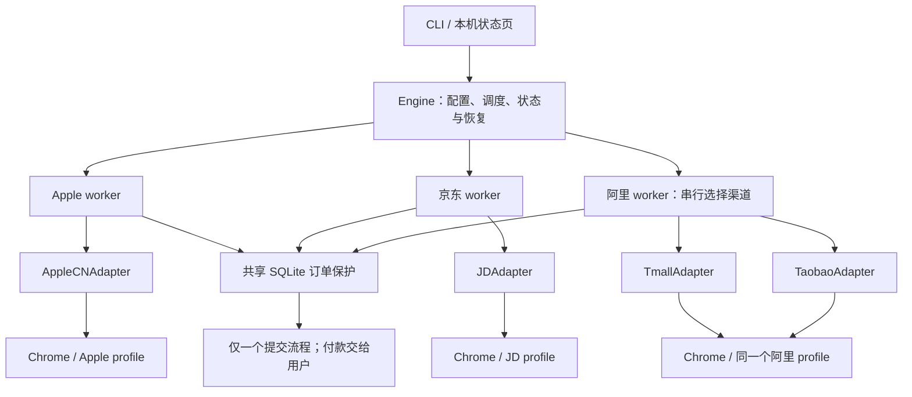
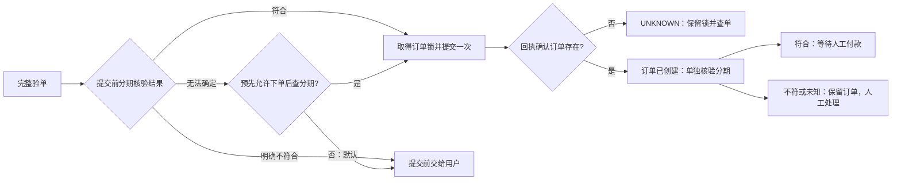

# 淘宝、天猫、京东接入设计

日期：2026-09-11。依据当前代码版本 f4ac5b3 与公开官方资料。本文是接入方案，未修改交易代码、未操作账号、未进行这些平台的实页下单验收。

## 1. 设计结论与范围

继续使用现有 Python + Playwright 正式版 Chrome + asyncio + SQLite + FastAPI。保留 Adapter / Engine 分工，增加渠道差异需要的会话、商品身份、报价及分期核验能力，不引入微服务或消息队列。

- 四个购买渠道：Apple、京东、天猫、淘宝；三个浏览器会话组：Apple、京东、阿里。
- 淘宝和天猫是两套页面适配器，但共用阿里会话、购物车操作所有权和订单去重空间。
- 优先接入经核实的京东官方/自营渠道，再接天猫 Apple Store 官方旗舰店；淘宝先做入口识别及监测，真实购买只开放给逐店核验通过的官方或授权渠道。
- 正常网页操作作为首选路线。本次没有确认到可供普通个人买家直接使用的通用官方下单 API；卖家订单查询/同步接口不能代替消费者结算。[淘宝订单同步文档](https://developer.alibaba.com/docs/doc.htm?articleId=1029&docType=1&treeId=49)、[京东商家 API 指南](https://help.jd.com/oapihelp/question-460.html)
- 目标仍是创建可核对的待付款订单，最终支付由用户完成。新品预售定金、尾款、预约、合约机、跨境与捆绑套餐在第一版转人工。
- 沿用当前配置中的数量、预算及单订单保护；不从旧研究计划引入额外购买数量。已有 SUCCESS / UNKNOWN 记录不能为接入新平台而清除。

## 2. 当前工程能复用什么

| 当前文件 | 已有能力 | 接入时需要补充 |
|---|---|---|
| src/platforms/base.py | 登录、选品、库存、购物车、结算、验单、提交、人工接管接口 | 保留主要接口；新增只读订单状态核查能力，默认 UNKNOWN |
| src/platforms/jd/adapter.py、tmall/adapter.py | 平台域检查和诊断 | 当前交易方法仍为 UNKNOWN，不具备实际购买能力 |
| src/browser/manager.py | 正式版 Chrome、持久化 profile、跨进程目录锁 | 按会话组管理 context、page、关闭及所有权 |
| src/core/engine.py | 状态机、并发任务、单次提交保护 | 按会话组组织 worker；在每个业务步骤前检查订单保护 |
| src/core/models.py、config.py | 型号、容量、颜色、全价、数量、优先级 | 淘宝渠道、销售方、地区、报价时间、费用明细、分期核验阶段 |
| src/order/checkout.py | 商品身份及金额严格比对 | 扩展确定的费用等式与店铺/地区/分期核验，不能只放宽价格相等条件 |
| src/storage/database.py | 原子抢占、提交前落盘、UNKNOWN 跨重启保留 | 平台订单引用、数量、总额、报价摘要、支付/分期状态及查单记录 |
| src/runtime.py、main.py、web/ | 共用运行入口 | 各渠道登录入口、按会话组拒绝抢占、展示实际可用能力 |

现有天猫商品 URL 配置只接受 tmall.com，而运行导航允许 tmall.com 和 taobao.com。应明确区分商品域与登录跳转域；这不应通过放开所有阿里域名来解决。

## 3. 渠道与会话架构

| 渠道 platform | session_key | 第一版物理目录 | 同组执行约束 |
|---|---|---|---|
| apple | apple | data/profiles/apple | 独立 |
| jd | jd | data/profiles/jd | 独立 |
| tmall | alibaba | data/profiles/tmall | 与淘宝串行 |
| taobao | alibaba | data/profiles/tmall | 与天猫串行，不启动第二个 context |

天猫官方说明其服务基于淘宝平台账户；共享会话是据此作出的工程设计，**不是已验证 Cookie 自动互通的承诺**。淘宝、天猫仍各自检测实际登录状态。[天猫基本功能隐私政策](https://terms.alicdn.com/legal-agreement/terms/suit_bu1_tmall/suit_bu1_tmall201801031144_60809.html)

实现规则：

1. 固定映射由一处维护；浏览器打开/关闭、CLI 初始化、登录、检查登录、停止和 reconcile 全部使用这份映射。同一路径加锁与关闭均去重。
2. 每个会话组只有一个 worker。阿里 worker 串行遍历淘宝、天猫候选，不能通过两个 adapter 各自的 asyncio.Lock 来保护同一页面。
3. 从选择 SKU 到加购、验单、提交、回执以及人工暂停，整条交易链保留会话所有权。WAITING_HUMAN 期间，同组其他渠道不能导航、监测、登录或关闭页面。
4. 操作锁与订单锁分开：操作锁防止页面相互干扰；SQLite 订单锁防止跨平台重复下单。
5. 首次在程序 Chrome 登录，随后复用本地 profile。过期或验证码、扫码、短信等交由用户处理；不收集密码或从个人 Chrome 导出 Cookie。
6. 恢复时先核对当前账号会话、页面阶段、商品和上次动作。人工换页、切账号后不能继续使用旧报价。
7. 新运行重建临时 SKU/页面状态；持久化提交记录保持独立，不能以“新 run”为理由清除上次提交意图。

状态与所有权同步调整：保留每个渠道的状态机、状态行及事件，组级仅记录 active_channel 和占用者，未轮到的渠道显示排队。首次处理新渠道须经过 PREPARING，不能从 IDLE 直接跳至 MONITORING；已经进入监测的渠道继续其合法的监测状态，不能每次轮转都重置准备流程。计数及重试进度保留到各渠道。worker 集合、停止、恢复与赢家判断统一按 session_key 定位，再路由到 active_channel；owner 作为不透明标识，另存所属会话组和当前渠道，不再靠拆字符串推断。旧订单 owner 原样保留。

会话占用独立于 asyncio 任务是否结束：保留 owner、active_channel、当前阶段和是否需要人工处理的记录。当前代码的 task.done() 不能再作为“浏览器可被抢占”的充分条件。UNKNOWN 或待人工付款即使工作协程已退出，登录、关闭、另一渠道启动仍要检查占用；显式停止可以结束浏览器会话，但不能清除持久化订单保护。应用重启后从订单保护恢复占用状态，先提供查单/人工处理入口。

跨域规则按商品、登录、购物车/结算、付款交接分阶段建立。主页面、弹窗及相关导航都要检查，不能只保护主动 goto。只开放实页已验证的精确主机和阶段转换；支付页允许显示给用户，并不意味着允许点击付款。短链接和淘宝搜索入口先解析到实际商品归属，再核对店铺；不得仅凭入口来自淘宝就改变商品的天猫身份。

## 4. 三个平台的适配重点

| 环节 | 京东 | 天猫 | 淘宝 |
|---|---|---|---|
| 店铺识别 | 核对店铺/销售方 ID、销售主体及自营或官方证据；配送标志不能替代销售方身份 | 核对旗舰店主体及店铺 ID，不只比较带“Apple”的名称 | 默认仅监测；官方/授权证据不足的店铺不能购买，天猫商品转交天猫适配器 |
| 商品身份 | 平台商品 ID、实际 SKU ID、选项与详情/结算摘要一致 | 商品 ID、销售方、所选属性组合一致 | 同天猫，但保留真实渠道和销售方；不以商品标题相同判等 |
| 库存 | 必须绑定目标配送地区和当前账号/购买资格 | 区分普通销售、预售、预约、售罄、验证未完成 | 同时区分套餐、二手/官换/跨境等非目标条件 |
| 价格 | 当前应付金额与可立即使用优惠；PLUS、补贴、返现等不能仅凭宣传价计入 | 优惠券及补贴必须在结算实际生效 | 不把“到手价”“预计返现”或月付金额视为应付全价 |
| 购物车 | 确认目标行及结算勾选项；已有同款不能重复加购 | 与淘宝共享购物车操作权 | 与天猫共享购物车操作权 |
| 分期 | 按实际收银台识别提供方和期数；白条条件可能在下单后才显示 | 花呗或银行卡入口按实际页面核验 | 不假定所有店铺/商品都能分 24 期 |
| 订单回执 | 订单号、商品/数量、总额与待付款状态相互印证 | 同左；不得只凭支付页 URL 判成功 | 同左；同一阿里商品跨入口去重 |

首版优先实现已验证的购物车路径。遇到“立即购买”专属路径时，不将它伪装成 add_to_cart 成功；另行实现明确的准备结算分支并验收后才启用。现有购物车不自动清空，非目标勾选项或陌生附件交给用户调整。

店铺信任来自事先记录的核验依据与当前页面身份比对，不是页面上任意“官方”文字。每个启用目标必须有明确商品 URL 和销售方白名单；空白或无法确定的销售方只允许检查，禁止购买。本文不填猜测的店铺 ID 或 selector。

## 5. 统一数据契约

优先扩展现有 Pydantic 模型，而不是引入多个数据服务。以下为拟新增字段，尚不能直接写进现有配置。

| 对象 | 最少需要表达的信息 |
|---|---|
| 商品身份 | platform、session_key、平台商品 ID、实际变体 ID/属性组合、seller_id/shop_id、销售方类型及核验时间 |
| 商品报价 | 型号/容量/颜色、CNY 单价、数量、配送地区引用、销售模式、库存状态、observed_at、有效期限 |
| 订单核验 | 上述身份、所选收货地址的本地引用/确认结果、所有结算行、商品小计、即时优惠、运费、其他费用、应付合计 |
| 分期方案 | 提供方、24 期期数、当前选中状态、用户承担的利息/服务费、总还款额、核验阶段与时间 |
| 下单结果 | 提交尝试 ID、订单创建状态、平台订单引用、支付状态、分期状态、回执核对结果 |
| 接入能力 | 已验证的登录/库存/加购/结算/未付款回执能力，以及 selector 证据日期；默认未验证 |

关键语义：

- 库存用 AVAILABLE / UNAVAILABLE / UNKNOWN，另记销售模式 NORMAL / PREORDER / RESERVATION。按钮可点不等于目标地区有货，也不等于满足购买资格。先保留现有 available 兼容字段，但只能从完整的新状态推导，不能把 UNKNOWN 写成无货。
- 地区以本机地址引用或平台地区 ID 表达；详细地址、手机号、Cookie、支付信息不进入日志或仓库。只能看见脱敏地址但无法区分所选地址时，要求用户确认。
- 报价与销售方、地区、SKU、数量、账号会话绑定。绑定对象改变或报价过期，必须重新取价和核验；示例有效期 30 秒只是程序默认值，不是平台承诺。
- 金额使用 Decimal。等式为：应付合计 = 商品小计 − 已生效即时优惠 + 运费 + 明示费用。每一项有页面证据；首版运费/额外费用默认允许上限为 0，非零项必须符合事先配置。
- 保留商品单价上限，并增加整单应付上限。平台券使 6799 变为 6798，也要形成新报价并重新核验，不能让任意价差自动通过。
- 分期本金使用当前实际应付合计，不使用划线价、预计补贴价或月供。“免息”但另收手续费也不满足零成本偏好。
- 去重键采用会话组 + 实际商品身份 + 变体 + 销售方。淘宝入口指向同一个天猫商品时不能生成第二个候选订单。
- 商品 ID 作为公开结构化字段保留；不要为了保留 URL 查询中的商品 ID，而把完整查询串及可能的会话参数写入日志。

接口继续以现有 PlatformAdapter 为主，平台差异由各自 adapter / parser / selectors 实现。验证状态可作为 adapter 的小型能力描述，尚未通过实页验收的渠道只开放相应早期步骤。不要把“实现了函数”直接标成“支持自动提交”。

## 6. 24 期免息与下单后核验

共同偏好：优先 24 期，用户承担的利息和分期服务费为 0，总还款额等于本金；最终付款、授信确认、验证码和人脸验证都由用户完成。Apple 的建行选项属于 Apple 渠道设置，不能复制成京东或淘宝的固定银行。

京东官方帮助说明，可先提交订单，再查看不同期数的服务费。这意味着部分订单在创建之前无法确定免息资格，必须明确分离订单状态与分期状态。[京东白条分期费用说明](https://help.jd.com/user/issue/201-565.html)

策略如下：

- 默认未知条件不自动提交。需要在订单创建后才能选期数的平台，首先明确展示这一限制。
- 如用户事先启用“可先创建一笔待付款订单再核验分期”，才能进入该分支；还必须同时满足原来的提交双开关、商品核验及全局订单锁。该设置不代表同意付款。
- 取得明确订单回执后即保留全局保护，不等待分期核验才占用订单名额。无 24 期、费用不为零或白条/花呗不可用时，暂停在现有订单；用户决定取消或如何支付，不自动重新下单尝试获取优惠。
- 提供方需要开通、授信协议、额度调整、绑卡或身份验证时停止自动操作，不代办信贷服务。普通支付确认、免密扣款按钮也不自动点击。
- 只有实页已经验证为“不产生支付”的选项才能由程序选择；按钮同时承担确认借款/付款等含义时，整体交给用户。
- 若一键购买会同时付款、创建订单与支付无法可靠分离，该渠道不开放自动提交能力。
- 月供可因展示舍入产生尾期差异，不能简单用整数月供 × 24 判断本金；以明确的费用和总还款明细为准，信息不足记 UNKNOWN。

淘宝/天猫所有商品支持 24 期免息并未获得证据。支付宝帮助可找到相关分期主题，但本次具体正文未能提取，因此不以帮助标题或宣传横幅作承诺，实际方案逐单核验。[花呗天猫分期帮助](https://cshall.alipay.com/lab/help_detail.htm?catId=238018&help_id=418687)

## 7. 订单保护、竞争与恢复

保留单个 SQLite 数据库中的原子订单锁，不给每个平台建立独立下单锁。

1. 每个会话组可以独立准备合格候选；从选品到回执保持本组交易所有权。
2. 每个业务步骤前复查全局 guard。另一组已获得当前 race 的提交权或已有 SUBMITTING / UNKNOWN / SUCCESS 时，其他组停止新的交易动作，不再继续加购。
3. 取得 CLAIMED 后再次完整验单；在最终点击之前持久化 SUBMITTING。
4. 只点击一次。明确未创建订单的拒绝才可记 REJECTED 并按策略释放。超时、白屏、未知回执、网络异常都保留 UNKNOWN。
5. 订单号及匹配回执确认创建后，执行层可继续沿用 SUCCESS，但必须新增 payment_state 与 financing_state。SUCCESS 不能同时代表已付款、已免息或已到货。
6. 用户完成验证后先读取当前步骤。加购是否成功未知时先读购物车，不重新点击；提交结果未知时只允许查单，不允许 resume 重放。
7. 只读查单仍无法确定时继续暂停；未看见一条订单不等于证明订单不存在。后续增加带证据的已取消/已关闭记录，不增加通用“强制解锁”按钮。
8. 新平台启用和数据库迁移不得删除当前 SUCCESS 锁，不能通过新建数据库绕开现有订单核查。

SUCCESS 继续作为现有执行状态机的终态。订单创建后的分期检查和人工付款交接，由独立的 financing_state / payment_state 及会话占用记录表达，不调用现有 _pause 把 SUCCESS 退回 WAITING_HUMAN。界面可同时显示“订单已创建”和“分期待人工核验”；分期失败不得进入通用重试、REJECTED 或释放订单锁的路径。

一期 race 的定义是“最快完成核验的合格会话组取得提交权”；每组内部遵守型号→容量→颜色优先级，阿里组内天猫先于淘宝。它不保证跨平台全局最高优先 SKU，也不保证最低价格。全局最优需要额外候选等待和仲裁，暂不加入。

订单表按一次尝试补充数量、实际合计、渠道/会话组、平台订单引用、核验摘要及付款/分期状态；订单引用仅本机保存，界面和日志脱敏显示。新增列通过版本化迁移完成，迁移前备份本机数据库，老订单不能默认成已取消或无订单。

## 8. 监测、暂停及用户界面

- 淘宝/天猫共用刷新预算，不能叠加两个高频轮询。京东独立预算；首版建议每组 10 秒一次公开页面刷新、带少量抖动，DOM 已更新时优先读取而非再刷新。该值是保守工程默认值，官方未承诺网页自动化配额。
- 开售前提前登录、确认商品/地区并准备页面；不直接把当前 Apple 的 0.5 秒配置复制给所有平台。缩短刷新间隔须先完成实测并观察页面限制。
- 服务端 Retry-After 优先，429/临时服务失败退避；验证码、异常访问、交易资格受限转人工，不使用代理轮换、批量账号、私有接口或绕过手段。
- 验证检测按当前可见表单、提示和页面阶段判断，避免网页页脚出现“验证码”等说明文字就误报。
- UI 分别显示渠道能力、所属会话组、登录状态、店铺、目标地区、商品与应付金额、订单状态、分期状态。天猫暂停时淘宝显示“阿里会话正在等待人工”，而不是单独运行。
- 保留“演练”和“允许提交”的区别；分期为 UNKNOWN 时明确写“尚未核验”。平台尚只有监测能力时，不显示可自动下单。
- 登录/检查登录/停止均校验会话所有权。页面仅允许同源本机控制，沿用现有额外配置字段拒绝和敏感信息脱敏机制。

## 9. 实施顺序与验收

| 批次 | 交付 | 放行标准 |
|---|---|---|
| A：共享基础 | session_key、同组 worker、销售方/地区/费用/分期契约、域名阶段规则 | 本地并发及金额反例通过；Apple 回归通过；不改真实订单 |
| B：京东 | 真实页面检查→商品/地区/库存→购物车→演练结算→回执与分期交接 | 使用已确认店铺和实际在售商品逐阶段验收；到购物车前不声称结算可用 |
| C：天猫 | 官方旗舰店身份、阿里登录、SKU/优惠、购物车/结算 | 使用实际账号和地区验收；共享购物车不被并发操作；分期期数/费用有独立证据 |
| D：淘宝 | 入口归属、店铺白名单、监测；随后增加通过验收的购买分支 | 同一阿里商品去重；非可信销售方阻断；不直接复制天猫 selector |
| E：多组竞争 | Apple/JD/阿里共同 race、重启恢复、只读查单 | 两组同时核验只提交一次；超时与重启不生成第二单 |

每一批按 capability 分别记录 PASS / FAIL / BLOCKED / NOT RUN。测试先使用本地固定页面回归，再使用程序自己的正式版 Chrome 做真实商品验证。支付不自动执行；此设计阶段没有新增测试订单授权或安排。

必须覆盖的反例：

| 场景 | 预期 |
|---|---|
| 天猫选完 512GB，淘宝开始导航 | 淘宝被会话所有权阻止 |
| 天猫等短信，淘宝检查登录或关闭窗口 | 拒绝抢占；保持人工页面 |
| 天猫提交超时后 worker 已结束，再点淘宝登录 | 仍被会话占用记录阻止，不能覆盖待核查页面 |
| 同名同价商品换成其他店铺 | 店铺身份不符，拒绝提交 |
| 另一个地区有货，目标地区无货/未知 | 不能当作可购买 |
| 页面写 24 期，实际选中 12 期或另收费用 | 免息核验失败 |
| 月供 284、合计 6799 | 使用合计做预算检查 |
| 优惠、运费或赠品行变化 | 重新取价并核验，未知项暂停 |
| 加购后超时、已有同款在车中 | 读车核对，不再点加购 |
| 京东下单后无 24 期方案 | 保留一笔订单与锁，人工处置 |
| 两组同时准备好；获胜方提交后超时 | 一次提交，UNKNOWN 保留，其他组停止 |
| 淘宝/天猫映射同一目录，执行 reconcile | 同一目录只加锁一次 |
| 用户确认关闭浏览器、重启程序 | 订单保护和会话资料均保留；不会自动重放 |
| 预售定金、免密付款或支付与创建不能分开 | 第一版转人工，不按普通待付款单执行 |

优先修改范围：core/models.py、config.py、engine.py；browser/manager.py；runtime.py、main.py；order/checkout.py；storage/models.py、database.py；jd 与 tmall 三件套及新增 taobao 三件套；web 状态与登录入口。只有出现真实重复逻辑时再抽取阿里公共解析函数，不建立万能电商框架。

## 10. 尚待实页确认的事项

当前 JD、天猫和淘宝具体 selector、完整登录跳转链、地区控件、销售方标识、购物车结构、收银台期数、待付款回执都没有本轮实页证据，保持 UNKNOWN。官方帮助只能证明业务流程可能存在，不能证明当前程序已适配。

下一步可直接进入批次 A 的基础改造，同时准备京东官方/自营商品的逐项实页检查；只有相应阶段通过验收后才开放下一个交易能力。
